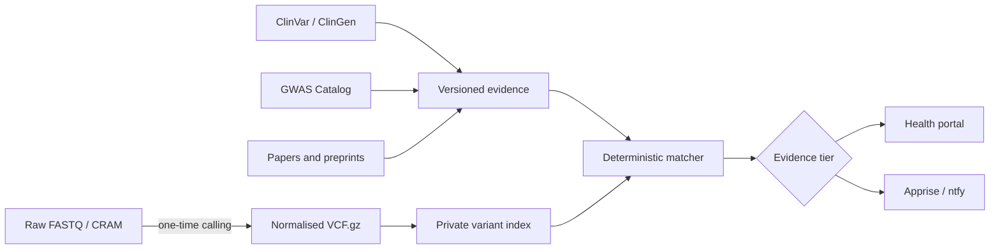

# Genomics Monitor

An evidence-first personal genome observatory. It keeps genotype facts separate from changing interpretations, matches curated or research evidence to a private variant index, and ranks findings without hiding the fun ones.

> [!IMPORTANT]
> This is research software, not a diagnostic device. A match is not a diagnosis, and absence from a call set does not prove absence from the genome. Clinically significant findings require confirmation in an accredited laboratory and review by an appropriately qualified professional.

## What it does today

- Imports single-sample VCF or VCF.gz files into an indexed SQLite store.
- Records the genome build, import time and source checksum.
- Ingests versioned evidence without overwriting older interpretations.
- Matches by rsID or exact chromosome/position/reference/alternate allele.
- Keeps clinical, health, trait, ancestry, research and uncertain findings distinct.
- Provides a small authenticated API for the Personal Health Portal.
- Accepts either an environment token or a Docker secret file.



## Evidence tiers

| Category | Typical content | Presentation |
|---|---|---|
| Clinical | Clinically curated assertions and pharmacogenomics | Prominent; confirmation required |
| Health | Non-diagnostic health associations | Visible with limitations |
| Trait | Pigmentation, taste, chronotype and similar traits | Friendly and explorable |
| Ancestry | Population history and evolutionary associations | Exploratory |
| Research | Recent GWAS, papers and preprints | Research feed |
| Uncertain | Weak, conflicting or poorly applicable evidence | Retained but subdued |

The category controls prominence, not ingestion. Legitimate matches are retained across every tier.

## Run locally

```bash
docker compose up --build
curl http://localhost:31030/health
```

Place the genome beneath the private data directory, then call the authenticated import endpoint from the host. The path is resolved inside the container:

```bash
curl -X POST http://localhost:31030/imports/vcf \
  -H "Authorization: Bearer $GENOMICS_API_TOKEN" \
  -H "Content-Type: application/json" \
  -d '{"path":"/data/input/genome.vcf.gz","genome_build":"GRCh38"}'
```

Do not commit genomes, findings databases, credentials or generated reports. The repository ignores common genomic formats and `data/` by default.

For a remote private-LAN deployment, `POST /imports/vcf-file` accepts a streamed multipart VCF upload, writes it to the protected input directory and immediately imports it. The endpoint uses the same bearer token and enforces a configurable size ceiling. Do not expose it through a public tunnel.

## ClinVar monitoring

`POST /sync/clinvar` starts a background sync from NCBI's official weekly GRCh38 VCF. The sync streams the release, checks exact locus and alleles against the private call index, and stores only assertions for alternate alleles actually present in the sample genotype. Reference calls and no-calls are not reported as personal matches.

ClinVar review status is retained and mapped conservatively: practice guidelines and expert panels remain distinct, multi-submitter agreement is labelled replicated, and conflicts remain explicit. ClinVar is a public archive of submitted classifications; it is not direct diagnostic advice, and NCBI does not independently verify every submission. Findings require suitable professional review before health decisions. Each retained assertion attributes and links back to ClinVar.

## Research monitoring and reports

`POST /sync/gwas` streams the NHGRI-EBI GWAS Catalog's literature-curated associations and retains only records whose stated effect allele is present in the private genotype index. These remain `research` / `single_study` evidence: statistical association is not causation, clinical validity or individual prediction, and applicability may depend strongly on ancestry, phenotype definition and study design.

`GET /reports/initial` produces a private aggregate baseline grouped by source, category, evidence level and clinical significance. `POST /reports/initial/notify` sends that aggregate through the whitespace-separated Apprise services in `APPRISE_URLS`; it never includes genotypes or variant-level findings. The intended notification model is one baseline followed by deduplicated alerts only for new or materially changed evidence.

Europe PMC paper/preprint and text-mined mutation monitoring is the next experimental tier. Automated text-mining hits must be labelled as leads until the reported allele, direction, cohort, population, phenotype and study design have been checked.

## Roadmap

1. Validate input reference assembly, sample count and contig naming.
2. Add allele-aware matching, genotype-dose checks and explicit no-call handling.
3. Add pinned offline Ensembl VEP annotation with provenance.
4. Detect changed ClinVar assertions and notify by tier.
5. Add GWAS Catalog and Europe PMC monitoring.
6. Add feedback, digests and Apprise notifications.
7. Expose a sanitised read-only portal contract.

## AI disclosure

This project is openly vibe-coded with OpenAI ChatGPT and Codex under human direction. AI assists with design, implementation, tests and documentation. It must not be treated as a genetics professional, and deterministic matching plus source provenance remain mandatory.

## Licence

Code is MIT licensed. Third-party datasets and annotation sources retain their own licences, attribution requirements and clinical-use limitations; redistribution of those datasets is not granted by this repository's licence.
